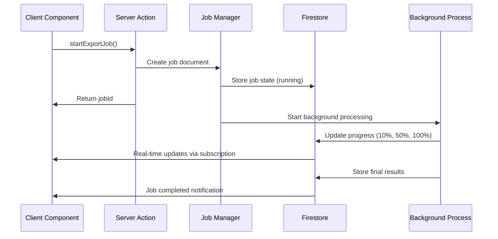

# Export Stage Architecture Solution

## Problem Summary

The original export stage implementation violated React Server Components (RSC) boundaries by passing client-side callback functions to server actions. This caused the fatal error:

```
Error: Attempted to call a temporary Client Reference from the server but it is on the client. 
It's not possible to invoke a client function from the server, it can only be rendered as a 
Component or passed to props of a Client Component.
```

## Root Cause Analysis

1. **Client callback passed to server**: `WizardShell` passed a `progressCallback` function to `executeExportStage` server action
2. **RSC boundary violation**: Server tried to execute client-side function containing React state setters
3. **Architectural mismatch**: Callback pattern doesn't work across strict client-server boundaries in Next.js App Router

## Solution Architecture

### Core Principle: Invert the Data Flow
Instead of **client pushing functions to server**, we now have **server writing data that client pulls**.

```
OLD: Client Function → Server (❌ RSC Violation)
NEW: Server Data → Firestore → Client Subscription (✅ Clean)
```

### Key Components

#### 1. Export Job Manager (`src/lib/export-job-manager.ts`)
- **Purpose**: Server-side job orchestration and state management
- **Features**:
  - Creates export jobs with unique IDs
  - Manages background processing without blocking client
  - Persists all progress/results to Firestore
  - Automatic cleanup of old completed jobs

```typescript
export async function startExportJob(params: ExportJobParams): Promise<{
  success: boolean;
  jobId?: string;
  error?: string;
}>
```

#### 2. Client Progress Hook (`src/hooks/use-export-job-progress.ts`)
- **Purpose**: Real-time subscription to export job state
- **Features**:
  - Firestore real-time listeners for job progress
  - Automatic reconnection on network issues
  - Survives page reloads and tab switches
  - Clean error handling and retry logic

```typescript
export function useExportJobStatus(jobId: string | null): {
  jobState: ExportJobState | null;
  isLoading: boolean;
  isRunning: boolean;
  isCompleted: boolean;
  isError: boolean;
  progress: ProgressState;
  output: ExportOutput;
  error: string | null;
  retry: () => void;
}
```

#### 3. Enhanced Export Component (`src/components/wizard/export-stage/export-stage-card-enhanced.tsx`)
- **Purpose**: UI component using job-based progress system
- **Features**:
  - Real-time progress updates via Firestore subscriptions
  - Reload-resilient state management
  - Clean error handling and retry functionality
  - Debug information in development mode

#### 4. New Server Action (`src/ai/flows/export-stage-execution-new.ts`)
- **Purpose**: Replace callback-based export execution
- **Features**:
  - Starts export job and returns immediately
  - No callback parameters (eliminates RSC violation)
  - Comprehensive validation and error handling

### Data Flow



### Benefits

#### ✅ KISS (Keep It Simple, Stupid)
- Single data flow pattern: Server writes → Firestore → Client reads
- No complex callback orchestration
- Consistent with other stage persistence patterns

#### ✅ DRY (Don't Repeat Yourself)
- Reuses existing Firestore persistence infrastructure
- Generic job pattern extensible to other long-running operations
- Consistent error handling and retry logic

#### ✅ Server-Side Logic
- All AI processing happens on server in background jobs
- Client only handles UI state and subscriptions
- Background jobs continue even if user closes browser

#### ✅ Persistence & Resilience
- Export state survives page reloads, browser crashes, network issues
- Users can close tab and return later to completed export
- Automatic recovery from interrupted operations

#### ✅ Clean Architecture
- Strict separation of client/server concerns
- No RSC boundary violations possible
- Extensible pattern for future features

### Migration Path

#### Files Changed:
- `src/lib/export-job-manager.ts` - NEW: Job management system
- `src/hooks/use-export-job-progress.ts` - NEW: Client progress hook
- `src/ai/flows/export-stage-execution-new.ts` - NEW: RSC-compliant server action
- `src/components/wizard/export-stage/export-stage-card-enhanced.tsx` - NEW: Job-based UI
- `src/components/wizard/wizard-shell.tsx` - UPDATED: Use new export system
- `src/components/wizard/stage-card.tsx` - UPDATED: Use enhanced export component
- `src/types/index.ts` - UPDATED: Added exportJobId to StageState
- `src/lib/firestore-adapter.ts` - UPDATED: Added setDocument method

#### Backward Compatibility:
- Old export components remain for reference
- Gradual migration possible
- No breaking changes to other systems

### Future Enhancements

#### Streaming Support (Optional)
If sub-second updates are needed:
```typescript
// Expose streaming endpoint for real-time updates
GET /api/exports/{jobId}/stream
// Returns ReadableStream with progress events
```

#### Advanced Job Management
- Priority queues for export jobs
- Parallel processing for multiple formats
- Resource usage monitoring and throttling

#### Analytics & Monitoring
- Export success/failure rates
- Performance metrics and optimization
- User behavior tracking

### Testing Strategy

#### Unit Tests
- Export job manager logic
- Progress hook state transitions
- Component rendering with different job states

#### Integration Tests
- Full export workflow end-to-end
- Page reload during export
- Network interruption recovery

#### Performance Tests
- Large document export times
- Concurrent export handling
- Firestore subscription performance

### Deployment Considerations

#### Firestore Rules
Ensure export-jobs collection has proper security:
```javascript
rules_version = '2';
service cloud.firestore {
  match /databases/{database}/documents {
    match /export-jobs/{jobId} {
      allow read, write: if request.auth != null;
    }
  }
}
```

#### Cleanup Jobs
Schedule periodic cleanup of old export jobs:
```javascript
// Cloud Function or cron job
await exportJobManager.cleanupOldJobs(7); // 7 days
```

## Conclusion

This solution permanently eliminates the RSC callback violation while providing a more robust, scalable, and user-friendly export system. The architecture follows clean coding principles and provides a solid foundation for future enhancements.

**Key Achievement**: Made the original error impossible to reproduce by design, not by patching. 