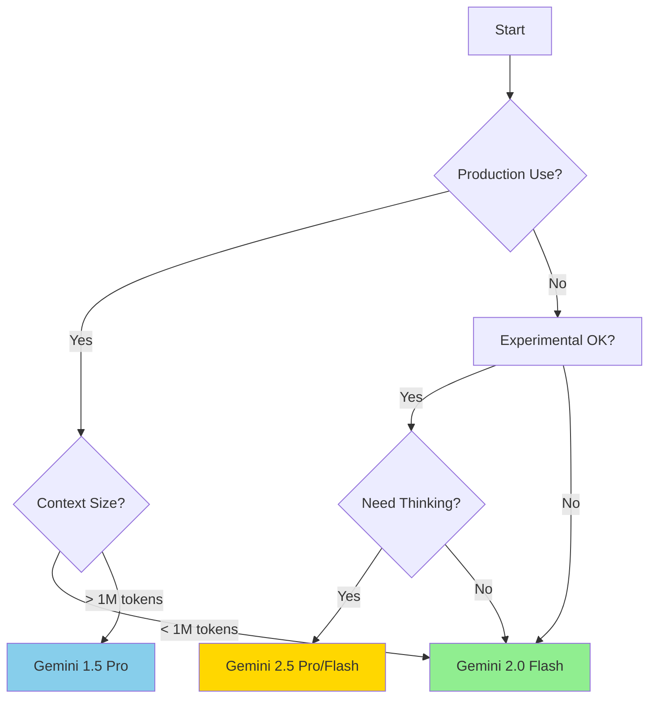

# Gemini Models Comparison Table (June 2025)

## Quick Comparison

| Model | Status | Context Window | Input Cost | Output Cost | Best For |
|-------|--------|----------------|------------|-------------|----------|
| **Gemini 2.0 Flash** | Stable | 1M tokens | $0.10/1M | $0.40/1M | Production, general use |
| **Gemini 2.5 Flash** | Preview | 1M tokens | $0.15/1M | $0.60/1M (non-thinking) | Cost-efficient, adaptive |
| **Gemini 1.5 Flash** | Stable | 1M tokens | Variable | Variable | Fast responses |
| **Gemini 1.5 Pro** | Stable | 2M tokens | Variable | Variable | Long context, complex tasks |
| **Gemini 2.5 Pro** | Preview | 1M tokens | $1.25-2.50/1M | $10-15/1M | Maximum accuracy |

## Detailed Feature Comparison

| Feature | 2.0 Flash | 2.5 Flash | 1.5 Pro | 2.5 Pro |
|---------|-----------|-----------|---------|---------|
| **Multimodal Input** | ✅ Text, Image, Audio, Video | ✅ Text, Image, Audio, Video | ✅ Text, Image, Audio, Video | ✅ Text, Image, Audio, Video |
| **Native Tool Use** | ✅ Yes | ✅ Yes | ✅ Yes | ✅ Yes |
| **Image Generation** | ✅ Yes ($0.039/image) | ❌ No | ❌ No | ❌ No |
| **Thinking Mode** | ❌ No | ✅ Yes | ❌ No | ✅ Yes |
| **Production Ready** | ✅ Yes | ⚠️ Preview | ✅ Yes | ⚠️ Preview |
| **Free Tier** | ✅ Yes | ✅ Yes | ✅ Yes | Limited |
| **Context Caching** | ✅ Yes | ✅ Yes ($0.0375/1M) | ✅ Yes | ✅ Yes ($0.31-0.625/1M) |

## Special Capabilities

### Video Processing
- **Gemini 1.5 Pro**: Up to 2 hours of video
- **Other models**: Limited video duration

### Audio Processing  
- **Gemini 1.5 Pro**: Up to 19 hours of audio
- **Other models**: Standard audio support

### Thinking Tokens
- **Gemini 2.5 Flash**: $3.50/1M thinking tokens
- **Gemini 2.5 Pro**: Included in output pricing

## Rate Limits

| Model | Free Tier | Paid Tier |
|-------|-----------|-----------|
| **Stable Models** | Standard limits | Higher limits |
| **Preview Models** | Restricted | Moderate |
| **Experimental** | Very restricted | Limited |

## Model Selection Guide

## Cost Optimization Tips

1. **Start with 2.0 Flash**: Lowest cost, most stable
2. **Use context caching**: Reduces costs for repeated content
3. **Monitor token usage**: Track input/output tokens
4. **Batch requests**: When possible, combine multiple prompts
5. **Use appropriate models**: Don't use Pro models for simple tasks

## Migration Notes

If currently using experimental models:
- `gemini-2.0-flash-exp` → `gemini-2.0-flash`
- Monitor for deprecation notices
- Test thoroughly before production deployment